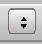
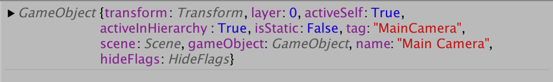
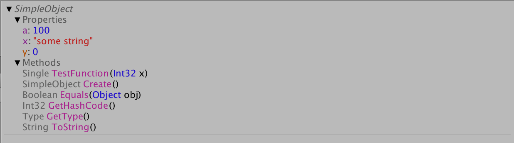
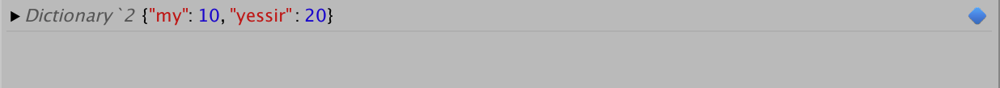
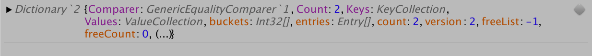
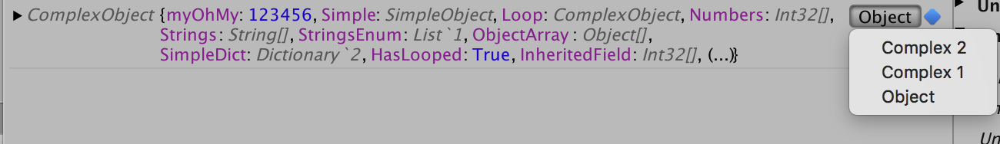
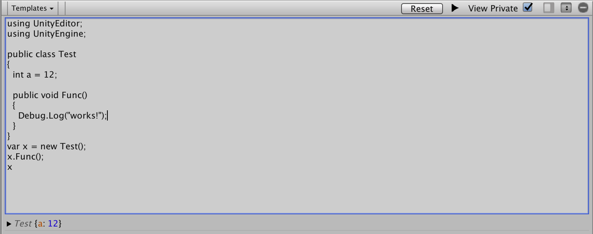
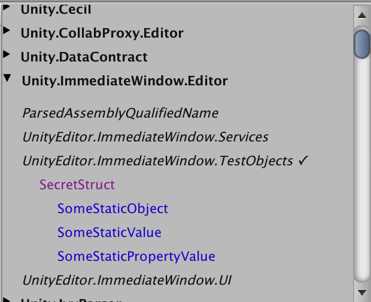
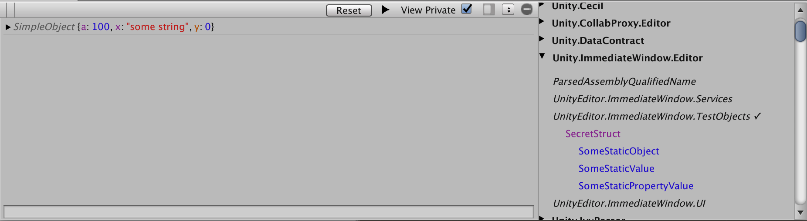

# Immediate Window

The immediate window is used to instantly evaluate C# code inside the Unity Editor.


## Installation

The window is accessible through the ```Window/Analysis/Immediate Window``` editor menu.

## Overview

The immediate window lets you run code and inspect returned object and their properties. It's not a tool aim at developement but rather
debug scenarios or editor API discovery.

## Usage

### Interface Overview

#### Toolbar

###### Reset

Resets the in-memory assembly state. If you had any variable or class created they will be cleared. Namespaces using will also be reset to default.

###### View Private

View private members when inspecting objects.

###### <a name="runCodeHelp"></a> Run Code

Press this to run the current code. Alternatively, press `Return` when in single-line mode or `Command+Return` on Mac or `Ctrl+Return` on Windows in multiline mode to do the same.

######  Show/Hide Assembly Inspector Toggle

Show/Hide the Assembly Inspector

######  Single/Multiline Mode Toggle

Toggle between multiline/single line mode (see below for details).

######  Clear Console

Clears the console of all output.

#### Keyboard Shortcuts

##### Multiline Mode

* Mac:`Command+Return` - Windows:`Ctrl+Return`: [Run Code](#runCodeHelp)

##### Single Line Mode

* `Return`: [Run Code](#runCodeHelp)
* `Keyboard Up Arrow` - Previous Command
* `Keyboard Down Arrow` - Next Command

### Single Line Command

You can use the single line input to type code and get it to evaluate instantly upon pressing `Return`.

For example, if you type this code:


you will see this result in the inspector:



### Object Inspection

#### Basics

You can use the object inspector to inspect an object and its properties. The object inspector will show the last object of any line of code. So for instance if you type: ```var a = 12; var b = 14```
You will only see the `b` object in the console. Note that if you added a semicolon `;` at the end of the previous line, you will only see `null` in the console, which is somewhat counter-intuitive.

Here is an example of an collapsed object inspector, which only shows a quick view of the object:


Clicking on the object will yield a more detailed view:


You can also click on the `methods` or, if available `interface` groups to view additional details:



#### Type views

Some types, such as Lists and Dictionaries have specific views in order to simplify their inspection. For instance, viewing a dictionary will yield something like this:



Instead of having every property of the object, only the most relevant is show, in this case, the key/value pair. You can notice at the end of the line a blue icon 
which, when clicked, will become grey and show the _full_ object view, like this:



In cases where there are _many_ views for a given type, you will see a dropdown like this which will let you select which view to use (in this case, the different views are `Object`, `Complex 1` and `Complex 2`):



You can also create your own views for your custom type, [as explained here](#typeview).

### Multiline Mode

Multiline mode allows you to write many lines of code at once. You can press `Command+Return` on Mac or `Ctrl+Return` on Windows to run the code in the text field.



#### <a name="codeSnippets"></a>Code Snippets

You can start off will pre-made code snippets. There is currently no way to save your own code snippets or have them automatically synced to a file though.


### <a name="assemblyInspector"></a>Assembly Inspector


The assembly inspector lets you inspect the available loaded assemblies. Clicking on any assembly will list the namespaces within that assembly, as this image illustrate.


Then, clicking an any namespace will list every _type which has static properties_. The idea is to browse through types
which have actual static items to view when debugging the current state of some editor component. This way you can browse through all your instances easily.
Ideally there would be some toggle to list every type or only this subset.



Finally, when clicking on any type's properties, you it will output the object for inspection in the console, as the image below, where the `SomeStaticObject` property has been clicked.



### Namespace References

You can add new namespace reference by simply using the [Assembly Inspector](#assemblyInspector) and clicking on any namespace (a ✓ checkmark will appear next to it).

This way, you don't have to type `My.Very.Long.Namespace.MyObject` and can simply type `MyObject` directly.

For simplicity of usage, these namespaces are automatically added in every coding session. Unfortunately, you can not remove them, so in the future, better control
should be given over these.

```
"UnityEngine",
"UnityEditor",
"System",
"System.Collections",
"System.Collections.Generic",
"System.Linq"
```

### <a name="typeview"></a>Creating your own type view

Simply create a class that implements `ITypeView` and you're good to go! Inspectors on your type will automatically be using your new view.

You also inherits form `ATypeView` which already provides a default implementation of most detail methods. You really only need to implement `GetView` in this case.

If you want to experiment with creating a custom type view, you can look at the `Custom Type View` and `Custom Expandable Type View` reference implementations in the
[Code Snippets](#codeSnippets) dropdown of the multiline view. Currently this will only output the correct inspector to the console when run once due to an unknown bug,
so it's not exactly suitable for iterating with yet.

# FAQ

###### Q: This is an overcomplicated design and too hard to use
*A: [Pull Requests](https://gitlab.cds.internal.unity3d.com/upm-packages/tools/com.unity.immediate-window) are welcomed, whining is not!*

###### Q: You rock!
*A: Don't we all?*

# Author Contact

Mathieu Rivest
mathieur@unity3d.com